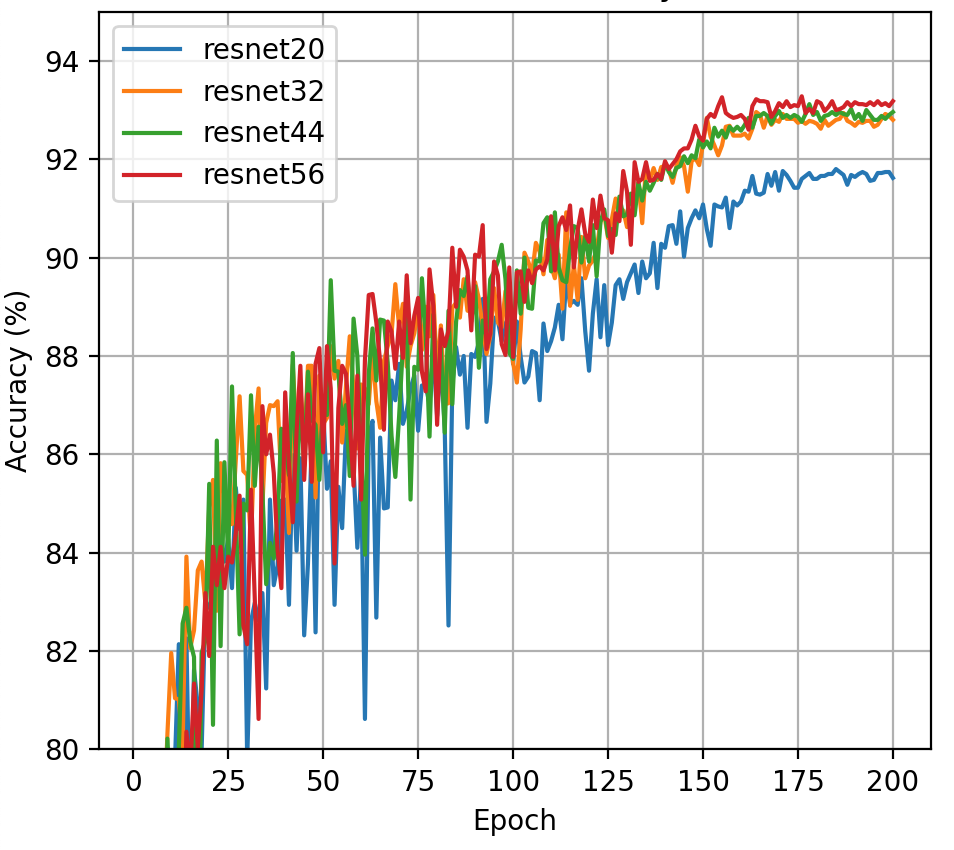
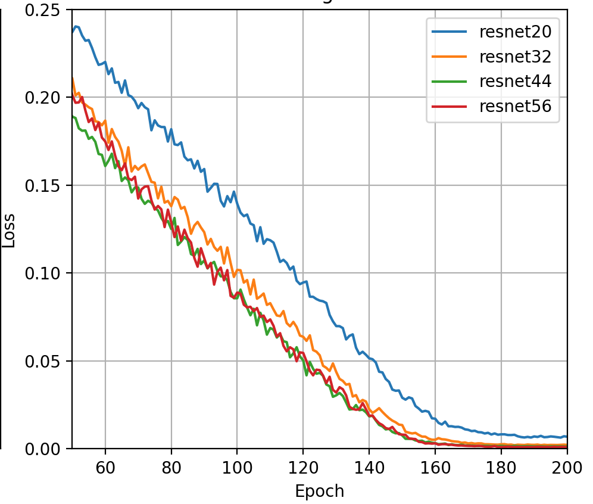

# Deep Residual Learning for Image Recognition: CIFAR-10 Reproduction

A PyTorch reproduction of the CIFAR-10 experiments from **Deep Residual Learning for Image Recognition** (He et al., 2016).

This project investigates the **degradation problem** in deep convolutional neural networks and demonstrates how **residual connections** enable the successful optimization of substantially deeper architectures.

---

## Motivation

Increasing the depth of a neural network should theoretically improve representational power. However, the original ResNet paper observed that deeper **plain networks** often become harder to optimize, resulting in higher training error and diminishing performance gains.

Residual Networks address this problem by introducing identity skip connections:

\[
y = F(x) + x
\]

allowing the network to learn residual mappings rather than complete transformations.

This project reproduces the CIFAR-10 experiments from the paper and compares optimization behavior between plain convolutional networks and residual networks.

---

## Implemented Architectures

### Plain Networks
- Plain20
- Plain32
- Plain44
- Plain56

### Residual Networks
- ResNet20
- ResNet32
- ResNet44
- ResNet56

All architectures follow the CIFAR-10 design described in the paper:

- Initial 3×3 convolution
- Three stages:
  - 16 channels
  - 32 channels
  - 64 channels
- Global Average Pooling
- Fully Connected Classifier

Network depth follows:

\[
\text{Depth}=6n+2
\]

| Model | Depth |
|---------|---------|
| Plain20 / ResNet20 | 20 |
| Plain32 / ResNet32 | 32 |
| Plain44 / ResNet44 | 44 |
| Plain56 / ResNet56 | 56 |

The only difference between corresponding models is the addition of residual skip connections.

---

## Training Configuration

| Hyperparameter | Value |
|---------------|--------|
| Optimizer | SGD |
| Learning Rate | 0.1 |
| Momentum | 0.9 |
| Weight Decay | 1e-4 |
| Scheduler | Cosine Annealing |
| Loss Function | CrossEntropy Loss |
| Dataset | CIFAR-10 |
| Epochs | 180 |

Training was performed using PyTorch on an NVIDIA T4 GPU.

---

# Results

## Validation Accuracy Comparison

<table>
<tr>
<td align="center">

### Plain Networks

</td>

<td align="center">

### ResNet Networks

</td>
</tr>
</table>

### Observations

- Shallower plain networks converge substantially faster.
- Increasing depth in plain architectures slows optimization.
- Plain44 and Plain56 exhibit noticeably noisier convergence behavior.
- Residual networks achieve consistently higher validation accuracy across all depths.
- Deeper ResNets continue improving while maintaining stable optimization.

---

## Training Loss Comparison

<table>
<tr>
<td align="center">

### Plain Networks

</td>

<td align="center">

### ResNet Networks

</td>
</tr>
</table>

### Observations

- Plain networks maintain significantly higher training loss as depth increases.
- Optimization becomes progressively more difficult in deeper plain architectures.
- Residual networks converge more rapidly and achieve lower training loss.
- The gap between shallow and deep models is substantially reduced when residual connections are introduced.
- Identity skip connections improve gradient propagation and optimization stability.

---

## Key Findings

### 1. Evidence of the Degradation Problem

Increasing depth alone does not guarantee improved performance.

The deeper plain architectures (44 and 56 layers) consistently train more slowly and exhibit worse optimization characteristics than their shallower counterparts.

---

### 2. Residual Connections Improve Optimization

Across all depths, residual networks:

- Converge faster
- Reach lower training loss
- Achieve higher validation accuracy
- Exhibit smoother optimization behavior

These findings are consistent with the conclusions presented in the original ResNet paper.

---

### 3. Deep Residual Networks Scale Better

While deeper plain networks suffer from optimization difficulties, deeper residual networks remain trainable and continue improving as depth increases.

This demonstrates the effectiveness of residual learning for training very deep convolutional neural networks.

---

## References

Kaiming He, Xiangyu Zhang, Shaoqing Ren, and Jian Sun.

**Deep Residual Learning for Image Recognition**

Proceedings of the IEEE Conference on Computer Vision and Pattern Recognition (CVPR), 2016.

Paper: https://arxiv.org/abs/1512.03385