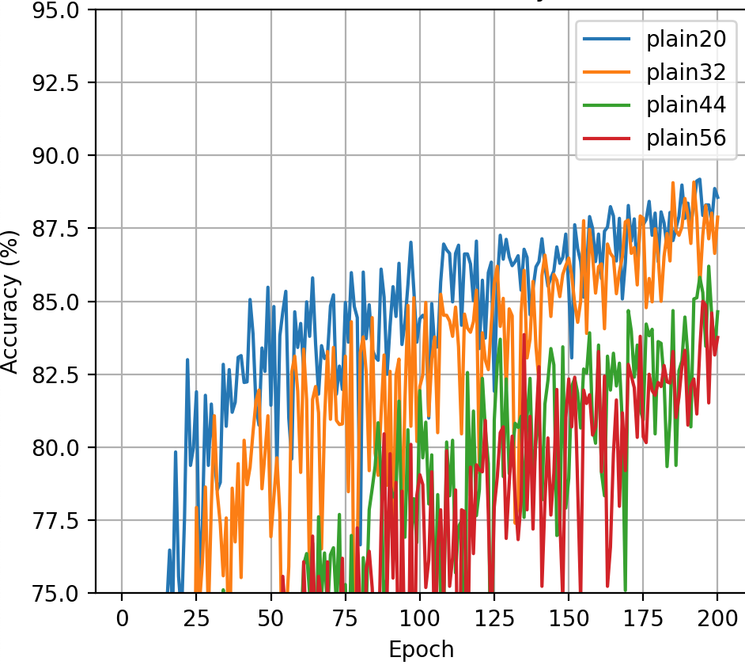
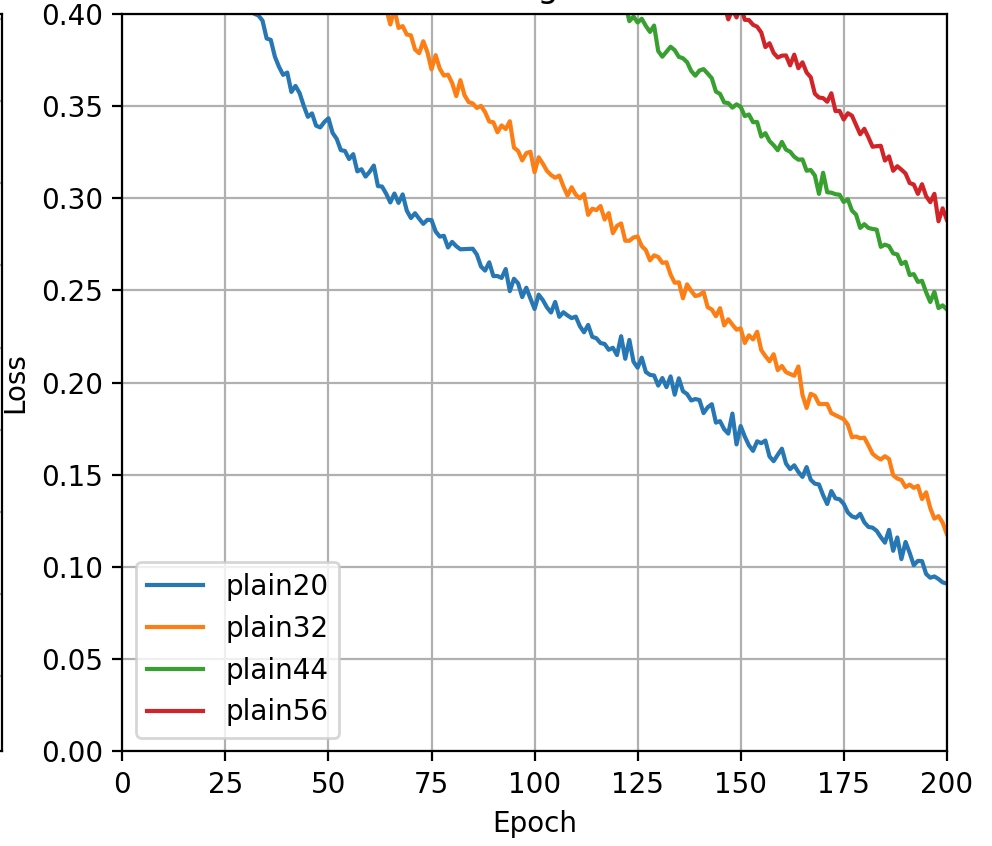

# Deep Residual Learning for Image Recognition: CIFAR-10 Reproduction

A PyTorch reproduction of the CIFAR-10 experiments from the paper **"Deep Residual Learning for Image Recognition"** by Kaiming He, Xiangyu Zhang, Shaoqing Ren, and Jian Sun.

This project investigates the degradation problem in deep convolutional neural networks and examines how residual connections enable successful optimization of substantially deeper architectures.

---

## Overview

Traditional deep neural networks do not always benefit from increased depth. The original ResNet paper demonstrated that simply stacking additional layers can make optimization more difficult, leading to higher training error and lower accuracy despite increased model capacity.

To reproduce this phenomenon, I implemented and trained both plain convolutional networks and residual networks on the CIFAR-10 dataset.

### Implemented Models

#### Plain Networks
- Plain20
- Plain32
- Plain44
- Plain56

#### Residual Networks
- ResNet20
- ResNet32
- ResNet44
- ResNet56

All models were trained using identical optimization settings to allow direct comparison between standard convolutional architectures and residual architectures.

---

## Architecture

The CIFAR-10 networks follow the architecture described in the original paper:

- Initial 3×3 convolution layer
- Three feature stages:
  - 16 channels
  - 32 channels
  - 64 channels
- Global Average Pooling
- Fully Connected Classification Layer

Network depth follows:

\[
\text{Depth} = 6n + 2
\]

where \(n\) represents the number of blocks in each stage.

| Model | Depth |
|---------|---------|
| Plain20 / ResNet20 | 20 |
| Plain32 / ResNet32 | 32 |
| Plain44 / ResNet44 | 44 |
| Plain56 / ResNet56 | 56 |

The only architectural difference between corresponding Plain and ResNet models is the addition of identity skip connections.

---

## Training Configuration

| Hyperparameter | Value |
|---------------|--------|
| Optimizer | SGD |
| Learning Rate | 0.1 |
| Momentum | 0.9 |
| Weight Decay | 1e-4 |
| Scheduler | Cosine Annealing |
| Loss Function | CrossEntropy Loss |
| Dataset | CIFAR-10 |
| Epochs | 180 |

Training was performed using PyTorch on an NVIDIA T4 GPU.

---

## Results

### Plain Networks

#### Validation Accuracy

#### Training Loss

### Residual Networks

#### Validation Accuracy

*(Results currently being generated)*

#### Training Loss

*(Results currently being generated)*

---

## Preliminary Observations

The plain network experiments exhibit behavior consistent with the degradation problem discussed in the original ResNet paper.

Key observations include:

- Shallower networks converge substantially faster.
- Increasing depth slows optimization.
- Plain44 and Plain56 show noticeably noisier validation behavior.
- Additional depth does not consistently improve validation accuracy.
- Deeper plain networks maintain higher training loss throughout training.

These results suggest that simply increasing network depth does not guarantee improved performance and may introduce optimization difficulties.

The residual network experiments will be used to determine whether identity skip connections mitigate these issues and allow deeper models to train more effectively.

---

## Future Work

- Complete ResNet training experiments
- Compare model performance as a function of depth
- Reproduce additional figures from the original paper
- Analyze optimization behavior through training and validation curves
- Evaluate the effectiveness of residual connections at increasing network depth

---

## References

Kaiming He, Xiangyu Zhang, Shaoqing Ren, and Jian Sun.

**Deep Residual Learning for Image Recognition.**

Proceedings of the IEEE Conference on Computer Vision and Pattern Recognition (CVPR), 2016.

Paper: https://arxiv.org/abs/1512.03385